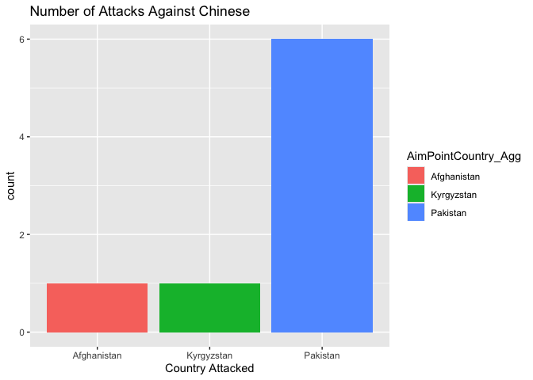
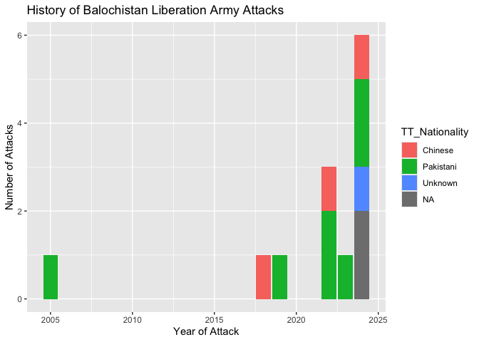
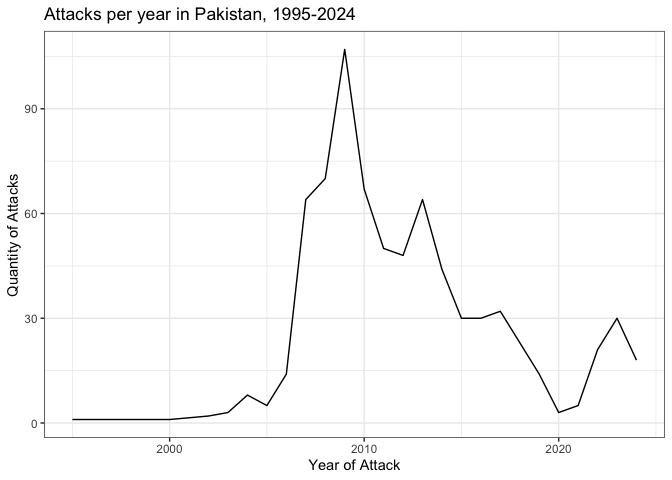
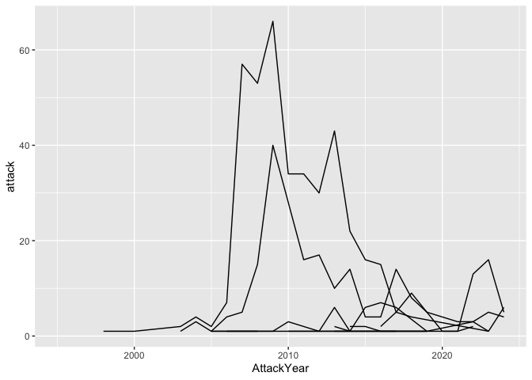

``` r
library("readr")
library("readxl")
library("tidyverse")
```

    ## ── Attaching core tidyverse packages ──────────────────────── tidyverse 2.0.0 ──
    ## ✔ dplyr     1.1.4     ✔ purrr     1.0.4
    ## ✔ forcats   1.0.0     ✔ stringr   1.5.1
    ## ✔ ggplot2   3.5.2     ✔ tibble    3.3.0
    ## ✔ lubridate 1.9.4     ✔ tidyr     1.3.1
    ## ── Conflicts ────────────────────────────────────────── tidyverse_conflicts() ──
    ## ✖ dplyr::filter() masks stats::filter()
    ## ✖ dplyr::lag()    masks stats::lag()
    ## ℹ Use the conflicted package (<http://conflicted.r-lib.org/>) to force all conflicts to become errors

``` r
excel_data <- read_excel("data/dsat_through_2024.xlsx", sheet = "tblAggregation_Attacks_QTA")
write_csv(excel_data, "data/dsat_research.csv")
```

``` r
dsat <- read_csv("data/dsat_research.csv")
```

    ## Rows: 8704 Columns: 93
    ## ── Column specification ────────────────────────────────────────────────────────
    ## Delimiter: ","
    ## chr  (41): MarkDelete, AttackType, Summary, VerifiedAttackType, CreatedBy, M...
    ## dbl  (45): AttackID, AttackYear, AttackMonth, AttackQuarter, AttackWeek, Att...
    ## lgl   (1): TeamAttack
    ## dttm  (6): AttackDate, SummaryDate, DateCreated, DateModified, VerifiedOn, E...
    ## 
    ## ℹ Use `spec()` to retrieve the full column specification for this data.
    ## ℹ Specify the column types or set `show_col_types = FALSE` to quiet this message.

``` r
pakistan_history <- dsat %>%
  filter(AimPointCountry_Agg == "Pakistan")
chinese_attacked_pakistan <- pakistan_history %>%
  filter(TT_Nationality == "Chinese")
```

``` r
attacks_2023 <- dsat %>%
  filter(AttackYear == 2023, AimPointCountry_Agg == "Pakistan") 
attacks_2024 <- dsat %>%
  filter(AttackYear == 2024, AimPointCountry_Agg == "Pakistan")
```

``` r
chinese_attacked_outside_china <- dsat %>%
  filter(AimPointCountry_Agg != "China", TT_Nationality == "Chinese") 
ggplot(chinese_attacked_outside_china, aes(x = AimPointCountry_Agg, fill = AimPointCountry_Agg)) +
  geom_bar() +
  labs(
    title = "Number of Attacks Against Chinese",
    x = "Country Attacked"
  )
```

<!-- -->

``` r
bla_attacks <- dsat %>%
  filter(Claimed_Agg2 == "Balochistan Liberation Army")

ggplot(bla_attacks, aes(x = AttackYear, fill = TT_Nationality)) +
  geom_bar() + 
  labs(
    title = "History of Balochistan Liberation Army Attacks",
    x = "Year of Attack", y = "Number of Attacks"
  )
```

<!-- -->

``` r
pakistan_yearly_summary <- pakistan_history %>%
  group_by(AttackYear) %>%
  summarize(attack = n())
# visualization
ggplot(pakistan_yearly_summary, aes(x = AttackYear, y = attack)) +
  geom_line() + 
  labs(
    title = "Attacks per year in Pakistan, 1995-2024",
    x = "Year of Attack", y = "Quantity of Attacks"
  ) +
  theme_bw()
```

<!-- -->

``` r
pakistan_aggregate_attacker <- pakistan_history %>%
  group_by(AttackYear, Claimed_Agg2) %>%
  summarize(attack = n())
```

    ## `summarise()` has grouped output by 'AttackYear'. You can override using the
    ## `.groups` argument.

``` r
##visualization:
ggplot(pakistan_aggregate_attacker, aes(x = AttackYear, y = attack, group = Claimed_Agg2)) +
  geom_line()
```

<!-- -->
